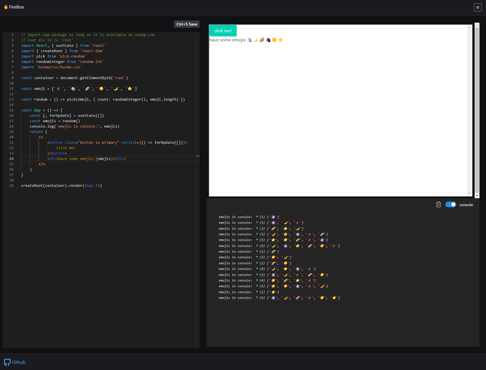

# Firebox

[](https://app.netlify.com/sites/firebox1/deploys)

## Intro

Simple CodeSandBox-like Web App, Install Dependencies and Run Code All In Your Browser.



https://firebox1.netlify.app/

1. the root div id is `root`
2. automatic install dependencies by resolving import statements

For some reason, the code doesn't work in development, it only works in production.

## Installation

```bash
npm i --force
```

## Quick Start

```bash
npm run serve
```

## Future Works

1. virtual file system
2. resolve local relative path
3. create fullstack to store user codes
4. resizer

## Credit

https://codesandbox.io/s/h4xfy

There is not much demo I can found on web, most are Codepen like example that cannot do import and transpilation

The above Codesandbox is one that has almost complete minimum viable solution.

Improvements:

1. update esbuild and editor API to modern version (2022)
2. add console (the original one is not working)
3. simplify logics, especially on the iframe
4. remake UI and add light theme
