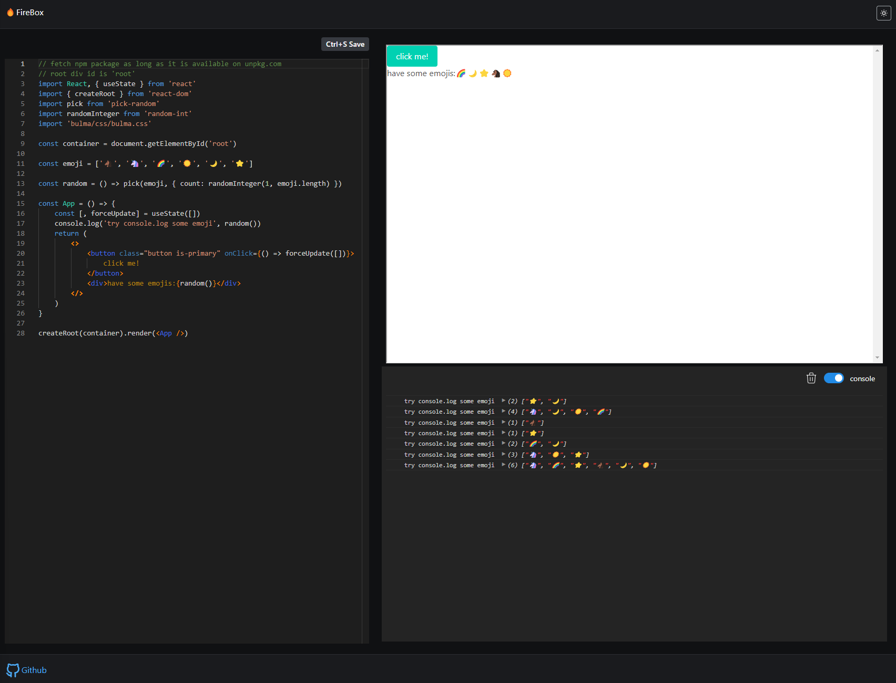

# Firebox

[](https://app.netlify.com/sites/firebox1/deploys)



view page: https://firebox1.netlify.app/

1. the root div id is `root`
2. automatic install dependencies by resolving import statements

For some reason, the code doesn't works in development, but only work in production,.

quick start:

```bash
npm run serve
```

potential improvement:

1. virtual file system
2. resolve local relative path
3. create fullstack to store user codes
4. resizer

credit: https://codesandbox.io/s/h4xfy

There is not much information I can found on web, the above repo is one that has almost complete minimum viable solution.

Improvements:

1. update esbuild and editor API to modern version (2022)
2. add console (the original one is not working)
3. simplify logics, especially on the iframe
4. remake UI and add light theme
